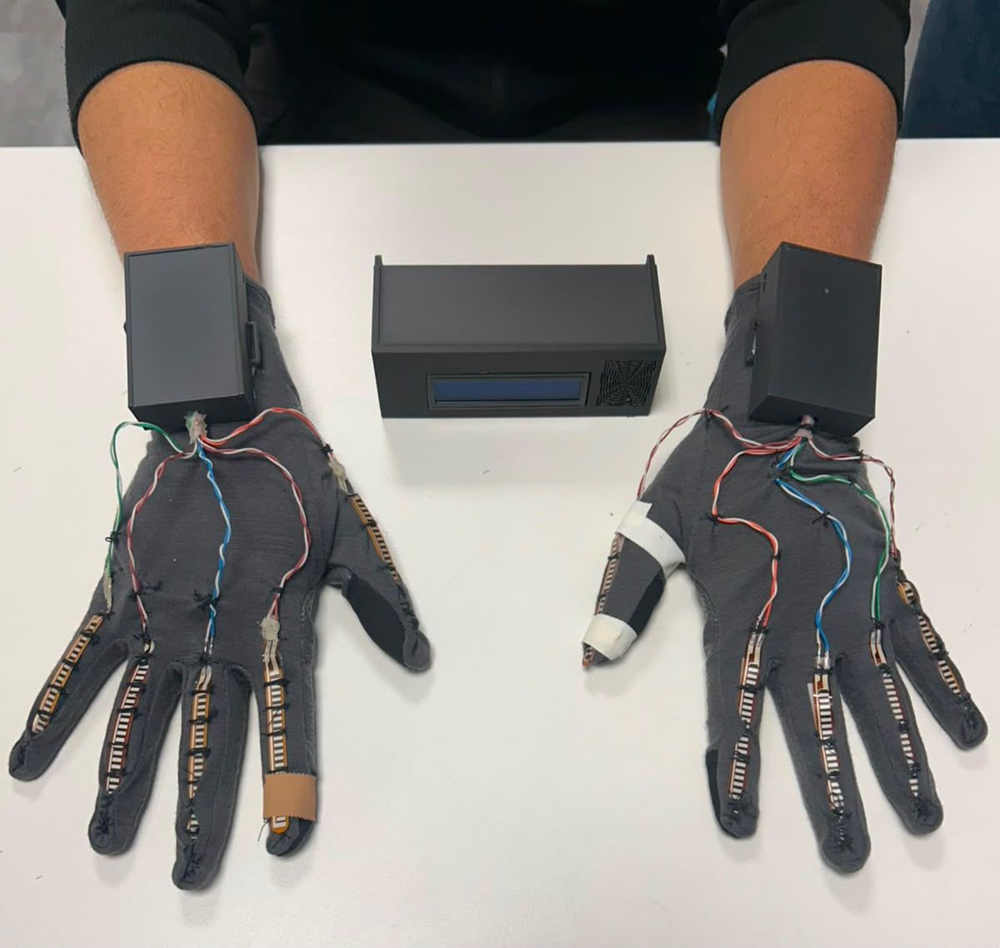
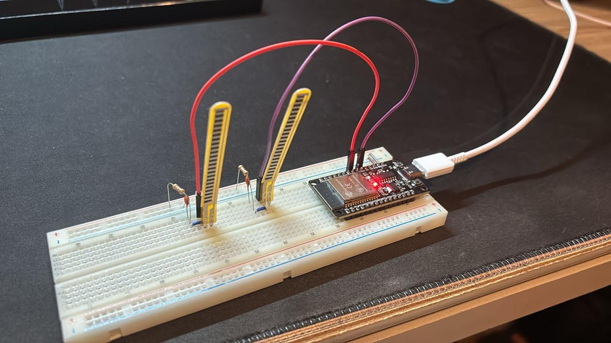
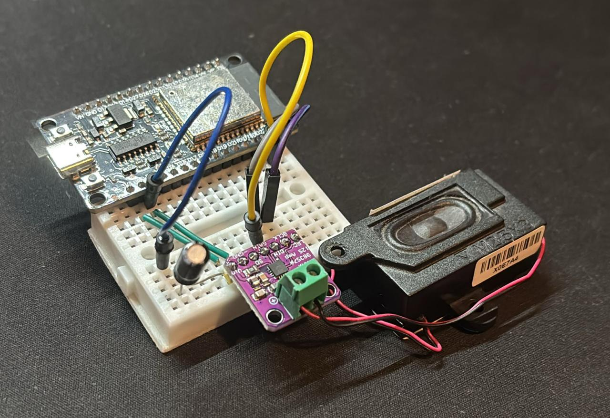

# SignTalk

Documentação Oficial

**Uma luva tradutora inteligente (Wearable) focada em quebrar barreiras de comunicação, traduzindo gestos de Libras para texto e áudio em tempo real através de Inteligência Artificial na Borda (TinyML).**

---

### Instituição
**PUC Minas**
Engenharia de Computação

### Equipe
- Amanda Canizela Guimarães
- Ariel Inácio Jordão Coelho
- Bernardo Rodrigues Pereira
- David Nunes Ribeiro

### Orientador
Prof. Ilo Amy Saldanha Rivero

---

## Visão Geral do Sistema

O **SignTalk** é construído sob uma arquitetura distribuída e sem fio, utilizando processamento *Edge Computing*. O sistema foi dividido em duas unidades principais para garantir a ergonomia da luva: um **Nó Transmissor** (a luva propriamente dita) e uma **Base Receptora** (onde ocorre o processamento neural e a saída de som).

### Fluxo da Arquitetura
1. **Coleta de Dados:** A luva realiza a leitura contínua da flexão dos dedos e movimentação espacial da mão, empacotando os sinais em structs e transmitindo via rádio (protocolo ESP-NOW).
2. **Comunicação ESP-NOW:** Protocolo de rádio de baixíssima latência envia os dados brutos da luva diretamente para a base sem necessidade de um roteador externo.
3. **Inferência TinyML:** A Base Receptora hospeda o modelo treinado. Ela captura a janela de movimentos, extrai características espaciais/temporais e adivinha qual é o gesto correspondente (Classificação).
4. **Saída de Áudio:** Após a tradução do gesto, a base envia o arquivo de áudio decodificado digitalmente para um amplificador e caixa de som externa.

---

## Componentes de Hardware

### Microcontroladores
Processadores poderosos de baixo consumo que executam o código C/C++ do sistema.

- **ESP32-S3:** "O Cérebro" localizado na base receptora, projetado para tarefas complexas de IA e decodificação de áudio digital.
- **ESP32-C3:** Minúsculo nó coletor que fica na luva. Escolhido pelo seu tamanho reduzido e integração com a antena sem fio.

### Sensores
A "Mão Virtual" — responsáveis por digitalizar a intenção mecânica do usuário em sinais elétricos.

- **10x Sensores Flex A12E-10X:** Fixados nas articulações para capturar o nível de curvatura dos dedos (via conversores ADC e resistores Pull-down 10kΩ).
- **MPU-6050 (GY-521):** Acelerômetro e Giroscópio I2C para orientar a inclinação tridimensional do pulso do usuário.

### Interface de Saída e Energia
Os hardwares responsáveis por tornar a tradução inteligível para as demais pessoas.

- **MAX98357A (Módulo I2S):** Amplificador que recebe áudio puramente digital do ESP32 para evitar ruídos e chiados analógicos.
- **Alto-falante (PK230007O00):** Reprodução clara do *Text-to-Speech*.
- **Display LCD 16x2 I2C:** Com backlight azul, responsável por mostrar na tela a letra ou palavra traduzida.
- **Baterias Lítio 3.7V:** Garantem a portabilidade total do sistema (vestível).

---

## Stack de Software e Ferramentas

### Edge Impulse & TinyML
Plataforma líder em *Machine Learning* para sistemas embarcados.
- **Treinamento:** Usamos o Edge Impulse para coletar amostras rotuladas (Gestos), extrair *features* em janelas de tempo e treinar uma Rede Neural Profunda (Classificação Keras).
- **Deploy:** O modelo treinado é compilado nativamente para uma biblioteca C++ leve o suficiente para rodar offline direto no processador do ESP32-S3.

### Automação com Python e CLI
Scripts criados sob medida pela equipe para otimizar a criação do *Dataset* de treinamento.
- **Coleta Via Script:** O arquivo `coleta_sign_talk.py` foi desenvolvido para ler a porta Serial, automatizar pausas de respiro para o usuário e gerar CSVs das luvas de forma eficiente.
- **Edge Impulse CLI:** Uso de terminal (`edge-impulse-uploader`) para fazer envios em lote dos arquivos CSV rotulados direto para a nuvem de treinamento.

---

*Projeto de Sistemas Embarcados © 2026 PUC Minas.*
