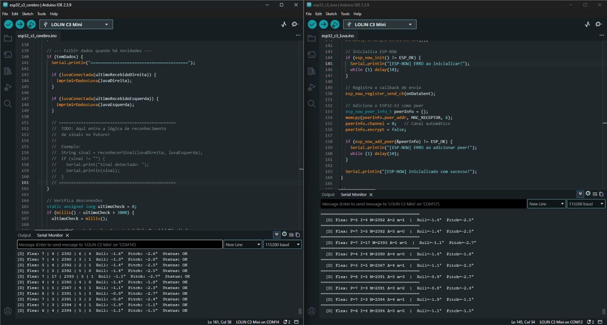

# SIGNTALK: Luva tradutora de Libras

**Integrantes:**
- Amanda Canizela Guimarães
- Ariel Inácio Jordão Coelho
- Bernardo Rodrigues Pereira
- David Nunes Ribeiro

**Orientador:** Prof. Ilo Amy Saldanha Rivero

**Belo Horizonte, 2026**  
**Pontifícia Universidade Católica de Minas Gerais - Curso de Engenharia de Computação – Sistemas Embarcados**

---

## Resumo
Este artigo apresenta o desenvolvimento do SignTalk, uma ferramenta em formato de luva (wearable), projetada para captar os movimentos das mãos e traduzir gestos da Língua Brasileira de Sinais (Libras) em texto e em áudio em tempo real. A arquitetura proposta é do tipo distribuída e sem fio, utilizando um microcontrolador compacto ESP32-C3 acoplado à luva (nó transmissor) para sensoriamento e um microcontrolador ESP32-S3 de alto desempenho atuando como base central de processamento (nó receptor). Os dados inerciais e de flexão são transmitidos via protocolo de rádio ESP-NOW com baixa latência. O grupo optou por utilizar Machine Learning para treinar o dispositivo, fazendo uso de ferramentas como (Edge Computing/TinyML) para tal. Ao longo do projeto, dificuldades como a calibração dinâmica de sensores e a mitigação de falhas elétricas e logísticas durante a transição da prototipagem, que serão discutidas ao longo do artigo. Portanto, apesar dos desafios, o objetivo do desenvolvimento da luva foi trazer maior conforto aos falantes de Libras e possibilitar uma comunicação fácil e rápida entre eles e os não falantes.

**Palavras-chave:** TinyML, Sistemas Embarcados, Libras, ESP32, ESP-NOW.

---

## Abstract
This article presents the development of SignTalk, a wearable glove designed to capture hand movements and translate Brazilian Sign Language (Libras) gestures into text and real-time audio. The proposed architecture is distributed and wireless, using a compact ESP32-C3 microcontroller attached to the glove (transmitter node) for sensing, and a high-performance ESP32-S3 microcontroller acting as the central processing base (receiver node). Inertial and flexion data are transmitted via the ESP-NOW radio protocol with low latency. The group chose to use Machine Learning to train the device, using Edge Computing/TinyML tools. Throughout the project, difficulties such as dynamic sensor calibration and the mitigation of electrical and logistical failures during the prototyping transition are discussed. Therefore, despite the challenges, the goal of developing the glove was to bring greater comfort to Libras speakers and enable easy and fast communication between them and non-speakers.

**Keywords:** TinyML, Embedded Systems, Libras, ESP32, ESP-NOW.

---

## 1 Introdução e Objetivos
A quebra de barreiras comunicacionais entre indivíduos surdos e ouvintes representa um dos maiores desafios sociais na contemporaneidade brasileira. Embora a Língua Brasileira de Sinais (Libras) seja o principal meio de comunicação dessa comunidade, a ampla maioria da população ouvinte não domina essa linguagem, gerando um cenário estigmatizado de exclusão. Projetos baseados em reconhecimento de gestos, como o apresentado pelo grupo, representam caminhos promissores na literatura de tecnologia assistiva, como demonstrado nos estudos de reconhecimento multissensorial estruturados pelo ecossistema WaveGlove [1].

O projeto SignTalk visa mitigar esse problema por meio do desenvolvimento de um sistema embarcado vestível, focado no processamento local de Inteligência Artificial (TinyML). Ao realizar as predições de forma offline na borda da rede (Edge Computing), elimina-se a dependência de conexões com a internet ou servidores externos, garantindo uma solução rápida e portátil. Ao longo de pesquisas, percebeu-se que, majoritariamente, esses dispositivos de inclusão são desenvolvidos com o uso de câmeras que captam movimento, o que limita aos usuários seu uso em ambientes não controlados. Dessa forma, o uso único e exclusivo de sensores e de microcontroladores permite maior liberdade no manuseio da tecnologia, visando melhorar a experiência dos consumidores.

Os objetivos específicos delineados para as etapas iniciais de desenvolvimento englobam:
- Validação e leitura independente de componentes sensores (flexão e inercial);
- Estabelecimento de canal de comunicação sem fio estável e com latência imperceptível para o usuário;
- Estruturação de uma placa definitiva para consolidação do hardware;
- Desenvolvimento de uma esteira automatizada para coleta de dados seriais e treinamento de uma Rede Neural Profunda para classificação dos sinais de Libras.

## 2 Metodologia e Arquitetura do Sistema
O diferencial do SignTalk está na divisão de responsabilidades de processamento através de uma topologia distribuída ponto a ponto, com o objetivo de melhorar a ergonomia da luva ao reduzir o peso de componentes eletrônicos montados diretamente sobre a mão do usuário, trazendo mais conforto a quem a utiliza.

### 2.1 Nó Transmissor (A luva sensoriada)
Na luva, encontra-se o microcontrolador **ESP32-C3 Super Mini**. Ele é o responsável por efetuar leituras contínuas dos seguintes transdutores e passar para o resto da ferramenta:
- **Sensores Flexíveis A12E-10X (5 por luva):** Responsáveis por identificar a curvatura independente de cada um dos dedos através de circuitos divisores de tensão elétricos.
- **1x Módulo MPU-6050 (GY-521):** Conectada via barramento $I^2C$ dedicada (pinos SDA=8, SCL=9), responsável pela captura de aceleração linear tridimensional (X, Y, Z) e velocidade angular, permitindo o cálculo em tempo real da orientação espacial de inclinação da mão (Roll e Pitch).

### 2.2 Nó Receptor (A base central de processamento)
Os dados coletados pelo nó transmissor são direcionados à base receptora central, gerenciada por um microcontrolador **ESP32-S3** (Dual-Core rodando a 240 MHz). O ESP32-S3 atua como o 'cérebro' do projeto, acumulando as informações recebidas e executando o algoritmo classificador localmente. Após a inferência da inteligência artificial, o nó receptor fornece dupla resposta de saída:
1. **Visual:** Através de um display de cristal líquido (LCD) ou OLED para exibição de texto;
2. **Sonora:** Utilizando síntese de áudio digital baseada no barramento $I^2S$ acoplado a um módulo amplificador **MAX98357A** e a um alto-falante (speaker), reproduzindo de forma sonificada a letra ou palavra traduzida.

### 2.3 Protocolo de Comunicação Sem Fio
Como já afirmado acima, para fazer a conexão dos dados brutos entre a luva e a base central, foi-se o protocolo de rede proprietário **ESP-NOW** da Espressif Systems, que dispensa pareamento tradicional do Wi-Fi convencional ou do Bluetooth, extinguindo a necessidade de roteadores intermediários, o que trouxe maior flexibilidade no uso da SignTalk. Essa abordagem assegura uma taxa de transmissão instantânea com latência desprezível. Todas as informações foram adicionadas na tabela abaixo, conforme detalhado na Seção 3.

*Figura 1: Protótipo Físico: *

## 3 Desenvolvimento da luva
Para alimentar com confiabilidade o modelo matemático do TinyML, os dados precisam trafegar de forma limpa e padronizada entre os microcontroladores e o ambiente de desenvolvimento.

### 3.1 Protocolo Rígido de Transmissão e Estrutura de Dados
Para a amostragem do protótipo, foi feita a gravação do alfabeto letra por letra em padrões de, no mínimo 20 vezes, que depois foram unificadas utilizando um código em C/C++. O trecho abaixo demonstra como o processo foi enviado pelo transmissor e desempacotado pelo receptor:

```cpp
struct DadosLuva {
    int id_luva;           // 0 para mao direita, 1 para mao esquerda
    int flex_polegar;      // Leitura analogica do ADC (0 a 4095)
    int flex_indicador;
    int flex_medio;
    int flex_anelar;
    int flex_minimo;
    float acel_x;          // Dados brutos de aceleracao da IMU
    float acel_y;
    float acel_z;
    float giro_x;          // Dados brutos de velocidade angular
    float giro_y;
    float giro_z;
    float roll;            // Angulo calculado de inclinacao lateral
    float pitch;           // Angulo calculado de inclinacao frontal
};
```
*Código 1: Estrutura de dados unificada para o protocolo ESP-NOW em C++*

### 3.2 Ferramenta de Automação de Banco de Dados
A coleta de amostras de gestos foi feita através de um programa sob medida na linguagem Python (`coleta_sign_talk.py`). Esse script conecta-se de forma serial (115200 baud rate) com o ESP32-S3, envia flags de comando como COLETA, introduz pausas programadas de 3 segundos para garantir estabilidade do movimento e confirmação do usuário e organiza automaticamente os fluxos de vetores recebidos em arquivos no formato Comma-Separated Values (`.csv`).

Posteriormente, esses conjuntos de arquivos `.csv` rotulados são enviados em lotes estruturados diretamente para a plataforma de Machine Learning em nuvem utilizando a interface de linha de comando oficial (`edge-impulse-uploader`). Por exemplo, todos os movimentos registrados como a letra A são colcados em um mesmo arquivo para fazer a pradronização do movimento.

### 3.3 Calibração Dinâmica e Modelagem TinyML
Para minizar inferências contra variações possíveis, como algum movimento brusco ou mudança de ideia do que sinalizar, ou desvios potenciais de tensão operacional gerados pelas descargas de baterias, o firmware do ESP32-C3 executa uma rotina de calibração ativa no instante em que é inicializado:
1. **Mão Aberta:** Gravação de limites mínimos lidos nos conversores analógico-digitais (ADC) de 12 bits;
2. **Mão Fechada:** Gravação dos limites máximos de compressão.

Esses dados de calibração colaboram para que o movimento realizado pelo usuário seja o mais correto possível, garantindo o êxito do projeto. Dentro do ecossistema **Edge Impulse**, extraem-se as características estruturais (*features*) em janelas de tempo fixas e treina-se uma Rede Neural Profunda de Classificação (Keras/TensorFlow Lite). Por fim, o compilador do Edge Impulse gera uma biblioteca leve e autônoma em formato C++ nativo que é embarcada no ESP32-S3, sendo executada em tempo real e de forma puramente offline por meio da rotina cíclica `run_classifier()`.



**Tabela 1: Especificação e Quantidades de Componentes do Hardware**
| Componente | Função Principal | Quantidade |
| --- | --- | --- |
| ESP32-S3 | Processamento de Inferência IA (Borda) e Saídas | 1 |
| ESP32-C3 Super Mini | Coleta de Sinais na Luva e Transmissão Sem Fio | 2 |
| Sensores Flexíveis A12E-10X | Captura da Curvatura Articular dos Dedos | 10 |
| Módulo MPU-6050 (GY-521) | Captura de Dados Inerciais e Orientação 3D | 2 |
| Amplificador MAX98357A | Amplificação de Áudio Digital | 1 |
| Alto-falante PK230007O00 | Saída Sonora de Voz Sintetizada | 1 |
| Display LCD 16x2 com I2C | Exibição Visual de Texto | 1 |
| Baterias de Lítio 3.7V | Alimentação do Sistema | 3 |

## 4 Dificuldades enfrentadas
Ao longo do desenvolvimento da luva, o grupo percebeu diversas dificuldades que atrapalharam na construção da luva tradutora. Problemas como fios muito rígidos, dificuldade na implementação da IA, sensores flex muito frágeis e confusão de movimentos foram alguns desses desafios.

### 4.1 Sensores flex
Inicialmente, os sensores flex, muitas vezes frágeis ou com curto fechado, foram grandes obstáculos ao longo de todo o processo. Por eles serem a peça chave na detecção do movimento, necessitava-se que estes fossem bastante precisos para informar a variação realizada ao dobrar os dedos. Entretanto, alguns alteravam mais que outros por motivos desconhecidos ao grupo, o que afetou em alguns sinais, já que, quando se trata da língua de sinais, qualquer mínima mudança nos movimentos representa outra coisa - S e A tem diferença apenas na posição do polegar, ambas tendo o punho fechado -, o que gerou dúvida na detecção por parte do programa.

### 4.2 Queima de Hardwares
O projeto sofreu um forte impacto material devido à queima indesejada de módulos eletrônicos essenciais. Durante a soldagem manual dos pinos, episódios de quebra dos pinos e curtos-circuitos involuntários provocaram falhas permanentes de comunicação nos barramentos lógicos digitais ($I^2C$ e $I^2S$). Interrompendo respostas aos comandos enviados pela CPU e corrompendo o fluxo contínuo de dados estruturados, esses componentes danificados precisaram ser integralmente descartados e trocados, o que demandou mais tempo e atrapalhou o cronograma inicial de desenvolvimento.

## 5 Desafios Técnicos e Limitações na Implementação da IA
A transição da bancada de testes para a aplicação prática revelou gargalos significativos na implementação da Inteligência Artificial. Embora o modelo tenha alcançado métricas de acurácia promissoras durante a validação no ambiente do Edge Impulse, o desempenho in loco apresentou instabilidades.

### 5.1 Divergência entre Simulação e Inferência em Tempo Real

<p align="center">
  
  <br>
  <em>Figura 2: Divergência entre Simulação e Inferência em Tempo Real.</em>
</p>

Observou-se que o modelo, após ser embarcado no ESP32-S3, não apresentava a mesma confiabilidade verificada nas métricas do Edge Impulse. A inferência em tempo real mostrou-se sensível a variações de ruído elétrico e características mecânicas que não haviam sido devidamente capturadas durante a fase de treinamento. Essa discrepância entre os dados "limpos" da simulação e a realidade do dispositivo vestível forçou a equipe a implementar rotinas de filtragem mais rigorosas para estabilizar a entrada de dados antes da inferência, visando reduzir as classificações incorretas causadas por micro-vibrações dos sensores.

### 5.2 Desafios de Calibração
Outro desafio identificado foi a instabilidade da calibração frente ao transporte e manuseio da luva. Notou-se que, mesmo com o sistema desligado, qualquer movimentação física ou alteração na tensão mecânica do tecido (repuxo) resultava em valores de leitura divergentes ao religar o dispositivo. Como o modelo é dependente desses ajustes, essa "deriva" nos valores de entrada comprometia a acurácia do classificador.

Para mitigar esse problema, a equipe desenvolveu uma rotina de autocalibração no firmware de inicialização. Ao ligar a luva, o sistema exige que o usuário mantenha a mão aberta na mesa rente ao corpo por alguns instantes para que o microcontrolador recalcule os limites de *offset* dos sensores de flexão, garantindo que o sistema se adapte às condições físicas atuais da luva e compensando as alterações sofridas durante o transporte. Entretanto, variações ainda se fazem presentes e melhorias devem ser feitas.

## 6 Resultados e Discussões
Apesar das dificuldades técnicas, o grupo conseguiu montar a luva em sua totalidade e seus testes apresentaram bons resultados. As leituras analógicas foram completamente validadas com alterações mínimas de resposta, conseguindo fazer a conexão com o áudio que respondeu bem às demonstrações realizadas.

Em relação à modelagem de Inteligência Artificial, os testes iniciais revelaram uma taxa de erro pontual por matriz de confusão: a rede neural apresentou dificuldades para diferenciar caracteres cujas posições espaciais são semelhantes, tais como as letras “O” e “E”. Esse comportamento tem relação com a falta de resposta na variação dos sensores e na rigidez dos cabos, o que já foi abordado acima, além de não terem um banco de dados de muito volume, variando de 20 a 60 amostras.

Para contornar essa barreira analítica, estão sendo adotadas medidas de expansão drástica do conjunto de dados volumétricos e readequação de posicionamento mecânico dos transdutores flexíveis sobre as dobras das articulações dos dedos, buscando ampliar a distância geométrica das features extraídas pelo algoritmo.

## 7 Conclusões e Trabalhos Futuros
O desenvolvimento do SignTalk ratificou a viabilidade técnica e a eficiência de se construir um ecossistema de tradução portátil e de baixo tempo de processamento operando diretamente em arquiteturas embarcadas distribuídas com TinyML. A separação física através do rádio ESP-NOW reduziu o peso na extremidade vestível, preservando a ergonomia sem prejudicar a entrega dos dados de movimentação.

Como etapas de desenvolvimento futuras para a consolidação completa do projeto, a equipe planeja:
- Ampliar massivamente a coleta do banco de dados para cobrir todo o alfabeto e numerais de Libras;
- Imprimir uma luva nova com todos os sensores e cabos na parte interna;
- Desenvolver e confeccionar caixas protetivas ergonômicas (cases) utilizando modelagem e impressão tridimensional (3D) para colocar a bateria e os microprocessadores, mas de modo a ficar mais leve e com menos informação no item móvel do projeto;
- Alterar os cabos para fios flexíveis para facilitar o movimentos;
- Mudanças no código para diminuir a variação de quando o dispositivo é muito movido para não perder a calibração préviamente feita.

## Referências
[1] KRÁLIK, M.; ŠUPPA, M. **WaveGlove: Transformer-based hand gesture recognition using multiple inertial sensors.** arXiv preprint arXiv:2105.01753v1, 2021.

[2] WARDEN, P.; SITUNAYAKE, D. **TinyML: Machine Learning with TensorFlow Lite on Arduino and Ultra-Low-Power Microcontrollers.** 1. ed. Sebastopol: O’Reilly Media, 2019.

[3] MONTEIRO, J. **Sistemas Embarcados: Hardware e Firmware na Prática.** 1. ed. Rio de Janeiro: Ed. LTC, 2010.
